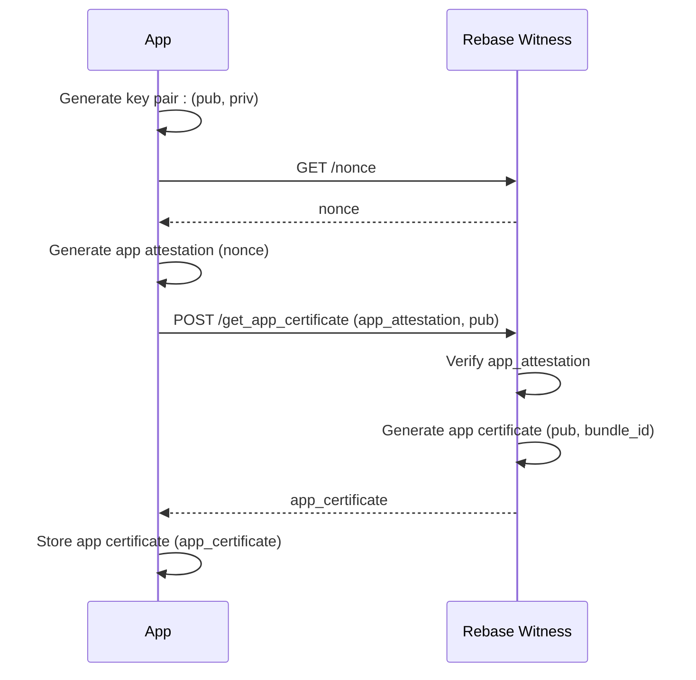
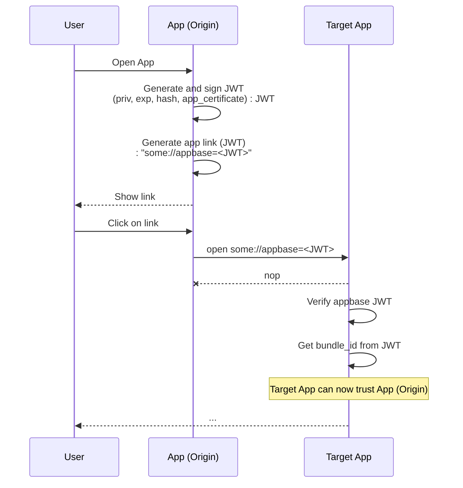

# Appbase

Appbase is a mechanism that allows developers to trust a native app without the need to integrate with Android or iOS attestation APIs directly.

It solves the following problems:

- Trust the previously untrusted origin of a deep link, universal link or app link.
- Trust the previously untrusted orgin of HTTP API call created by a native app.

This can be done through binding a private key, that is managed in the secure, non-exportable, tamper-proof key storage of the mobile platform, to an app attestation after a trusted witness verified the native app through Android Safetynet/Play Integrity and iOS DeviceCheck/App Attest Services. 

For example, today it is not possible for a native app wallet such as MetaMask to verify the native app origin of a WalletConnect request.

## Appbase Flow

### Obtaining the app certificate

- App obtains a `nonce` from a trusted Rebase witness.
- App generates an app attestation using Android or iOS services which incorporates the `nonce`.
- App sends a certificate request to the Rebase witness along with the app attestation and the public key.
- Witness verifies the app attestation and generates a certificate that is bound to the public key and bundle ID of the app.
- Witness provides the certificate to the app.
- App stores the certificate.

### Using the app certificate

- Native app creates a JWT that includes the app certificate, a short expiration date, hash of the actualy request and a nonce, signed by the certified keypair.
- Native app appends the JWT to a deep link, app link or universal link as an additional parameter.
- Native app presents the deep link, universal link or app link, e.g., `some://request?appbase=<JWT>`
- User clicks on the link which opens the target native app.
- Target native app verifies the JWT by verifying the signature, the expiration date, the hash against the public key in the app certificate.
- Target native app reads the bundle ID and can trust that the origin is what they say they are.

